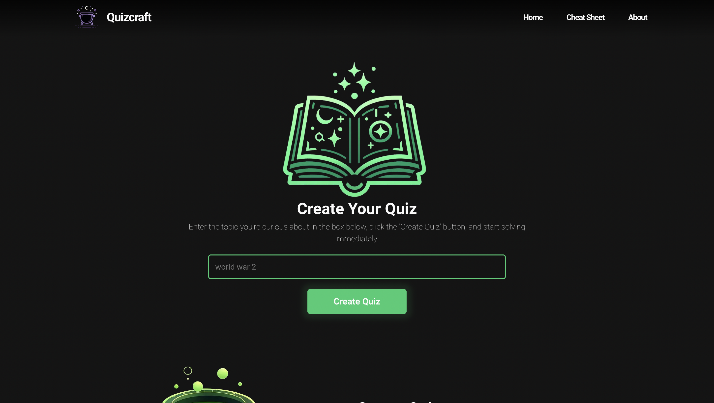
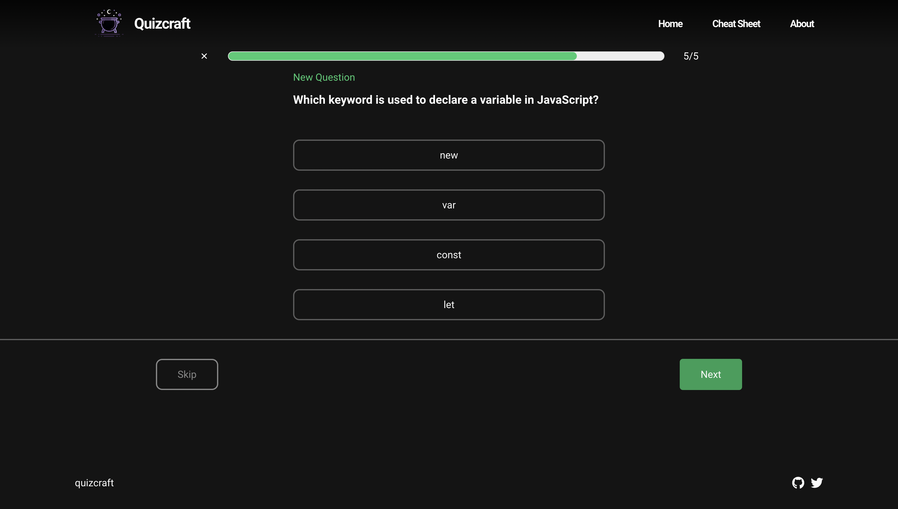

# Quizcraft
<p align="center">
  
</p>


QuizCraft transforms learning into a captivating adventure, powered by artificial intelligence. It is designed for people of all ages, making learning easier and more fun with a wide variety of topics. With QuizCraft, you will enjoy learning in a fun and magical way.


## Tech

I've used following technologies:

- Next.js
- @ai-sdk/openai
- Vercel AI SDK
- Zustand
- React Icons

## Features

- Dynamic Question Handling: Questions are managed through Zustand, allowing seamless state management.
- Interactive Progress Bar: A visual representation of quiz progress that fills as questions are answered.
- Real-time Answer Tracking: User answers are tracked and displayed on the results page.
- Responsive Design: The application is designed to be responsive and user-friendly.

## New Features Coming Soon

- Score Comparison: See your scores and compare them with others.
- Custom Cheat Sheets: Create your own cheat sheets to help remember important information.

<p align="center">
  
</p>
## Development

You can run the app with the following commands:
```bash
// clone the repo
pnpm install
pnpm run dev
```

## License

MIT